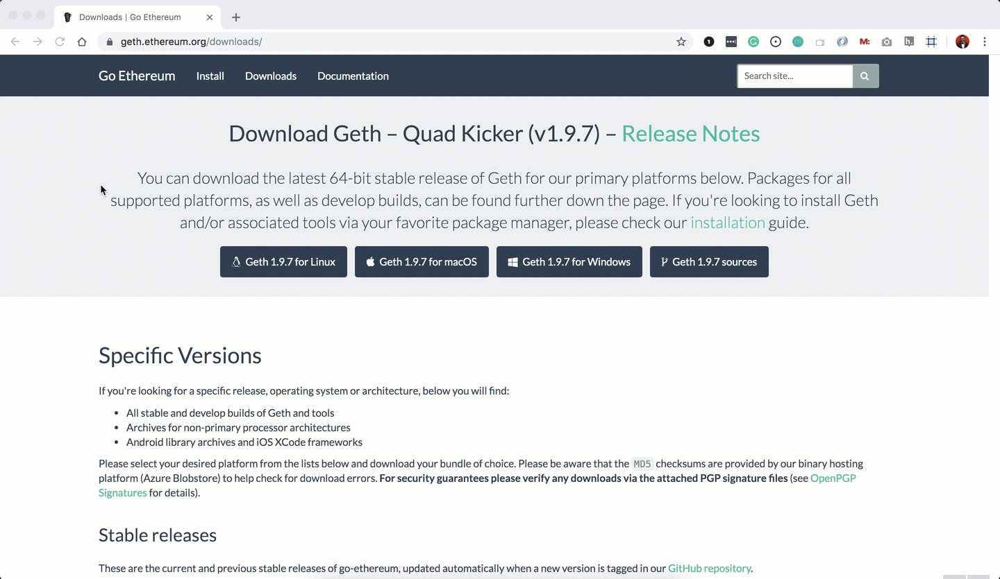
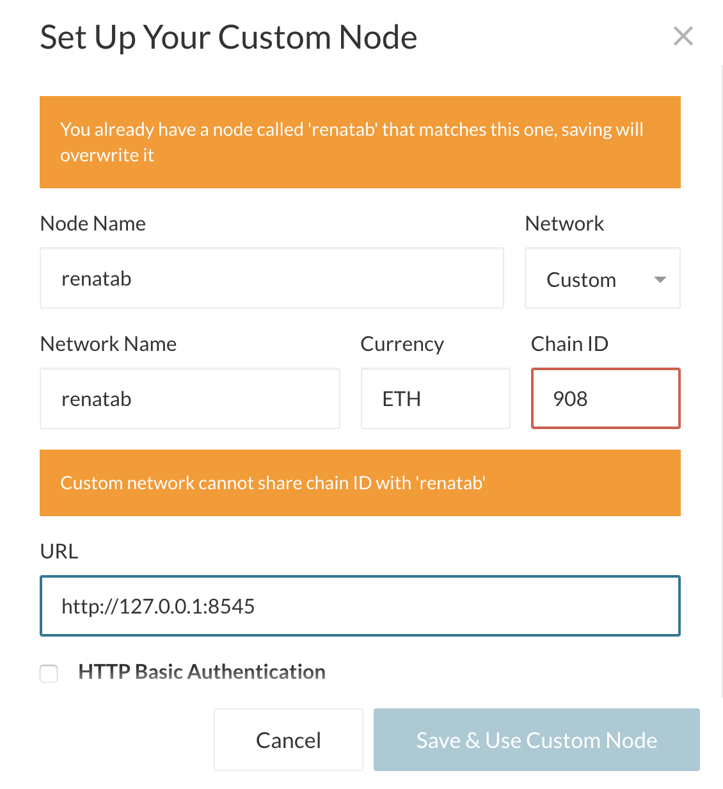
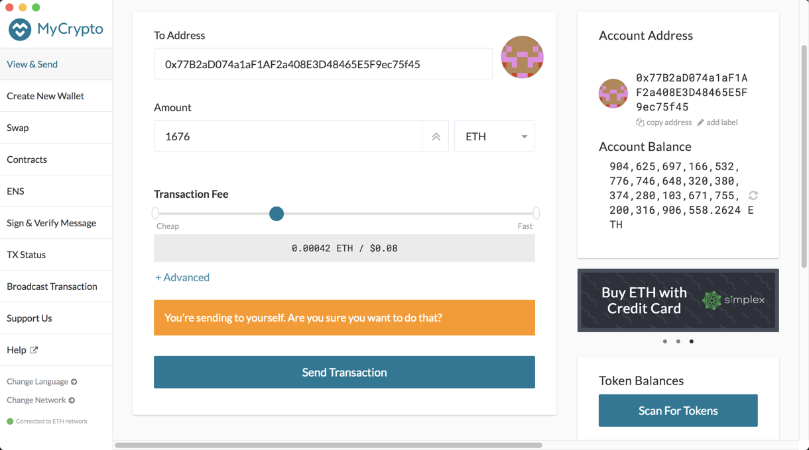

# How To: Create A Private Blockchain Network 

## This step-by-step guide can be used to create a Proof of Authority (PoA) algorithm which is typically used for private blockchain networks. A PoA requires pre-approval of, or voting in of, the account addresses that can approve transactions (seal blocks).

## Installation and Environment Setups - for Mac users only

### 1. MyCrypto App
#### An open-source web-based wallet application, MyCrypto lets you manage the plethora of Ethereum-based tokens and make transactions in the blockchain, all while keeping your private keys offline.

- Open your browser and navigate to the downloads page at https://download.mycrypto.com/

- Choose the appropriate installer for your operating system and once you download the installer, open the file, and follow the installation wizard.

When you've successfully downloaded MyCrypto, you will see an easy tutorial which you can read through. 

Important note for Mac users:

The first time you open MyCrypto, you will see a warning message. You can safely click on the "Open" button to start the application.

## Allowing Permission to Open Apps from Unidentified Developers

Certain applications, like MyCrypto, may be automatically blocked by the Mac OS when attempting to open the "unidentified" application. Therefore, in order to allow the use of the MyCrypto app, you may need to allow it as an exception to your Mac OS security preferences. 

To do so perform the following.

- Open the MyCrypto app, it should produce a warning error saying that you cannot open the application due to security reasons. Therefore, we'll need to make a security exception for it.

- Look to the top-left of the screen and click on the Apple Logo and navigate to System Preferences > Security & Privacy.

- Click in the General tab and allow your MyCrypto application security access to be opened in the "Allow Apps Downloaded From" section. Your screen should look similar to the image below.

### 2. GoEthereum App 
#### Go Ethereum is one of the three original implementations of the Ethereum protocol. It is written in Go, fully open-source and licensed under the GNU LGPL v3. We will use Go Ethereum Tools to create our very own blockchain, from the genesis block to mining tokens and making transactions.

To install the Go Ethereum Tools, follow the steps below:

- Open your browser and navigate to the Go Ethereum Tools download page at https://geth.ethereum.org/downloads/

- Scroll down to the "Stable Releases" section and proceed depending on your operating system.

2.1. Installing in OS X.
Click on the "Geth & Tools 1.9.7" to download the applications bundle archive.

- After downloading the tools archive, open your "Downloads" folder, and you will find a file named geth-alltools-darwin-amd64-1.9.7-a718daa6.tar.gz in OS X. 
Note: the last numbers in the filename could vary depending on the last built available.

- Decompress the archive in the location of your preference in your computer's hard drive, and rename the containing folder as Blockchain-Dev or any other name you prefer. I recommend using a location that can be easily accessed from the terminal window like the user's home directory.

## Now it's time to start building your own blockchain!

#### The following steps can be followed by Mac users. 

1. Open your Terminal and navigate to the folder where you downloaded your GoEthereum app. In my case, the folder was called Blockchain-Dev.

Now, you will generate two new nodes with new account addresses that will serve as our pre-approved sealer addresses.

2. Create accounts for two nodes for the network with a separate datadir for each using geth:

./geth --datadir node1 account new 

This command will give you a 'Public address of the key' and 'Path of the secret key file'. Save both in a notepad for your reference under Node 1. You will need a Public address later.

./geth --datadir node2 account new

Again, this will give you the 'Public address of the key' and 'Path of the secret key file'. Save both in a notepad for your reference under Node 2. You will need this Public address later.

For easy reference, look at the image below for a visual of the code to be entered in Terminal. (Of course you should never share your secret key with anyone! But this is a test case so you will see mine here.) 

Next, you will generate your genesis block (first block on the blockchain).
 
3. Run ./puppeth command in your Terminal and name your network (in my case, I named it "renatab"), and select the option to configure a new genesis block.

4. Select Configure new genesis

5. Select Create new genesis from scratch 

6. Choose the Clique (Proof of Authority) consensus algorithm.

7. Paste both account addresses from Step 2. one at a time into the list of accounts to seal (refer to the saved addresses in your notepad).

8. Paste both addresses again in the list of accounts to pre-fund. There are no block rewards in PoA, so you'll need to pre-fund.

9. You can choose no for pre-funding the pre-compiled accounts (0x1 .. 0xff) with wei. This keeps the genesis cleaner.

For reference, refer to the below image of the code to be entered into Terminal for Steps 3 to 9. 

10. Add a Chain ID. It can be any random number, but must be at least 3 numbers. In my example: 908

11. Complete the rest of the prompts, and when you are back at the main menu, choose the "Manage existing genesis" option.

12. Next select Export genesis configurations. This will fail to create two of the files, but you only need the yournetworkname.json file. Check that this json file has been created in the folder where you downloaded your GoEthereum app (again, in my case this is called the 'blockchain-tools' folder).

You can now exit the terminal using Ctrl + C.

For easy reference, see screenshot below of steps 10 to 12. 

With the genesis block creation completed, you will now initialize the nodes with the genesis' json file.

1. Using geth, initialize each node with the new yournetworkname.json using the below two commands:

./geth --datadir node1 init yournetworkname.json
./geth --datadir node2 init yournetworkname.json

#### Now the nodes can be used to begin mining blocks.

2. Run each node in two separate terminal windows with the commands:

./geth --datadir node1 --unlock "Your Node 1 Public Address Here" --mine --rpc --allow-insecure-unlock

You will then by prompted to type in your password and hit enter - even if you can't see it while typing it in, it will be entered. 

Now do the same in a new terminal for your second note, using the enode address from Node 1. See image below where you will find your enode in Node 1. 

./geth --datadir node2 --unlock "Your Node 2 Public Address Here" --mine --port 30304 --bootnodes "enode://of your Node 1" --ipcdisable --allow-insecure-unlock

Again, you will be prompted to type in your password and hit enter.

NOTE: Add --syncmode full and/or --miner.threads if your are having trouble with nodes mining.

#### You're almost there! Your private PoA blockchain should now be up and running! With both nodes running, the blockchain can be added to the MyCrypto app for testing! 

1. Open the MyCrypto app on your desktop, then click Change Network at the bottom left:

2. Click "Add Custom Node", then add the custom network information that you set up in the genesis.

- Make sure that you scroll down to choose Custom in the "Network" column to reveal more options like Chain ID. 

- Type ETH in the Currency box.

- In the Chain ID box, type the chain id you generated during genesis creation.

- In the URL box type: http://127.0.0.1:8545. This points to the default RPC port on your local machine.

- Finally, click Save & Use Custom Node.

**Note: Because I have already created this node, the two yellow warning messages will not apply to you.

After connecting to the custom network in MyCrypto, it can be tested by sending money between accounts.

3. Select the View & Send option from the left menu pane, then click the Keystore file.

4. On the next screen, click Select Wallet File, then navigate to the keystore directory inside your Node1 directory, select the file located there, and you will be prompted to enter your password and then click 'Unlock'.

This will open your account wallet inside MyCrypto.

Looks like we're filthy rich! This is the balance that was pre-funded for this account in the genesis configuration; however, these millions of ETH tokens are just for testing purposes.

5. In the 'To Address' box, type the account address from Node2, then fill in an arbitrary amount of ETH:

6. Confirm the transaction by clicking "Send Transaction", and the "Send" button in the pop-up window.

7. Click the "Check TX Status" when the green message pops up, confirm the logout.

You should see the transaction go from 'Pending' to 'Successful' in around the same blocktime you set in the genesis.

You can click the Check TX Status button to update the status.

### Congratulations! You've just created a blockchain and sent a transaction! 

